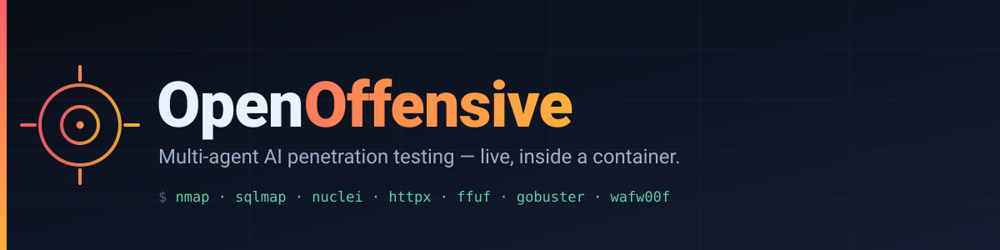
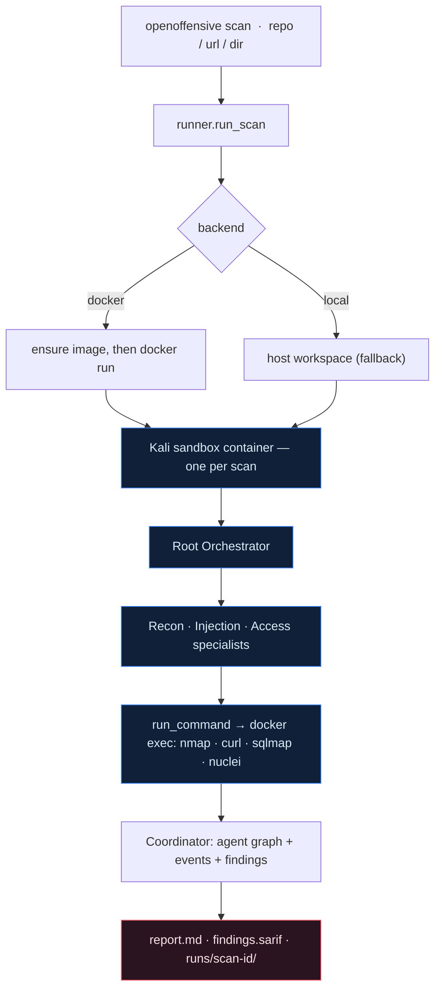

<div align="center">



<p><strong>A Docker-based, multi-agent AI pentester with a live dashboard.</strong></p>

<p>
<a href="LICENSE"></a>


</p>

<sub>openoffensive.ai</sub>

</div>

---

Each scan spins up an isolated Kali Linux container, pulls the target's source into it, and turns
a **root orchestrator** loose: it delegates to specialist sub-agents — **Recon, Injection, Access** —
that each drive a tool-use loop, running `nmap` / `curl` / `sqlmap` / `nuclei` and friends inside the
container via `docker exec`. Every finding is confirmed from real command output and carries a
severity, a CVSS score, evidence, a proof-of-concept, and a fix — streamed to the browser live.
Point it at a git repo, a live URL, or a local directory.

> [!IMPORTANT]
> **A model key is required.** A real model (Anthropic Claude) drives every agent, so set
> `ANTHROPIC_API_KEY` (and `pip install 'openoffensive[llm]'`) before scanning. Without a
> reachable model the scan fails loudly at preflight — it never falls back to canned or demo
> output. Findings only ever come from real tool output.

## ✨ Highlights

- **A sandbox per scan** — one throwaway container, created at the start of a run and `docker rm -f`'d at the end.
- **Multi-agent by design** — a root that only orchestrates, plus Recon, Injection, and Access specialists running as real parallel threads against one shared container.
- **Tools run inside the box** — the core tool is `run_command`, a `docker exec` into the sandbox; agents also `read_file`, `report_finding`, and `load_skill`. There is no host-side HTTP tool.
- **Runs anywhere** — Docker where a daemon is available (it will even try to start one), or a host-execution fallback where Docker isn't.
- **Validated findings** — nothing is reported unless it was proven from real output; each carries CVSS, evidence, a PoC, and a fix.
- **Live dashboard** — agent graph, findings, and a Server-Sent-Events log with a mode badge and run history.
- **Portable artifacts** — every run persists to `runs/<scan_id>/` as JSON, SARIF 2.1.0, Markdown, and a full event stream.
- **CI-friendly** — exit codes: `0` clean, `1` error, `2` findings.

## 🚀 Quickstart

**Prerequisites:** Python 3.9+ · (optional) Docker for the sandboxed container · a required model key
for the AI agents ([Anthropic](https://console.anthropic.com/)).

**Install** — one line puts the `openoffensive` CLI on your PATH (prefers `pipx`, falls back to `pip --user`):

```bash
curl -sSL https://raw.githubusercontent.com/Ifthikar20/open-offensive/clean-main/install.sh | bash
```

<sub>Rather read before you pipe? The script is [`install.sh`](install.sh). Or install the package
directly: <code>pipx install "openoffensive[llm] @ git+https://github.com/Ifthikar20/open-offensive.git"</code>.
Set <code>OPENOFFENSIVE_NO_LLM=1</code> for the zero-dependency core (a scan still needs the
<code>[llm]</code> extra and a key).</sub>

**Configure** your AI provider (the agents require a key):

```bash
export ANTHROPIC_API_KEY="your-api-key"
```

**Run your first assessment:**

```bash
openoffensive scan https://github.com/org/repo          # clone a git repo and scan it
openoffensive scan ./path/to/source                     # scan a local directory
openoffensive scan https://your-app.com --authorized    # a live target you're allowed to test
openoffensive serve https://your-app.com --authorized   # live dashboard for a target
```

`scan` requires an explicit target — a git repo URL, a live URL/host, or a local directory; there is
no default demo target. Each run preflights the model, scans the target, prints the live log, writes
artifacts to `runs/`, and exits `2` when it files findings. A non-local URL target requires
`--authorized`.

<details>
<summary><b>Install from source</b> (for contributors)</summary>

```bash
git clone https://github.com/Ifthikar20/open-offensive.git
cd open-offensive
pip install -e '.[llm]'          # editable install with the LLM extra
openoffensive doctor --build     # check readiness, build the sandbox image
```
</details>

> [!TIP]
> **No Docker daemon, or a locked-down network?** Set `OPENOFFENSIVE_SANDBOX=local` to run the tools
> directly on the host (no container isolation), or build a portable image with
> `./openoffensive/sandbox/build-image.sh`, which installs the toolset from PyPI, git, and static
> release binaries where Docker Hub and apt are blocked. See [docs/USAGE.md](docs/USAGE.md).

## 🧩 How it works



The runner preflights the model, ensures the sandbox, gets the target's source in, and runs the root
agent; the specialists share that container and drive their tools through `docker exec`. Findings and
every step flow through one **Coordinator** (agent graph + event bus + findings store), which the
dashboard reads over SSE. When the run ends the container is removed and the findings become a report,
SARIF, and a persisted record. Full walkthrough: [docs/ARCHITECTURE.md](docs/ARCHITECTURE.md).

## 🧰 The sandbox & toolset

By default each scan runs in a Kali container built from
[`openoffensive/sandbox/Dockerfile`](openoffensive/sandbox/Dockerfile) (nmap, sqlmap, nikto, whatweb,
dirb, gobuster, wafw00f, curl/wget, git, python3, jq, dnsutils, netcat). The target's source is pulled
in — a git repo is `git clone --depth 1`'d into `/workspace/<name>`, a local directory is `docker cp`'d
in, a live URL is probed over the network — and every tool call is a `docker exec` into that box.

For environments where Docker Hub and apt are unreachable, a **portable image**
([`Dockerfile.toolbox`](openoffensive/sandbox/Dockerfile.toolbox) + `build-image.sh`) assembles an
equivalent toolset (nmap, sqlmap, wafw00f, wapiti, dirsearch, arjun, ffuf, gobuster, nuclei, httpx)
from PyPI, git, and static release binaries — building through an egress proxy when one is present.

## 🖥️ How the agents run

A real model (Anthropic Claude) drives every specialist through a tool-use loop: it decides the next
command, runs it in the sandbox, reads the real output, and repeats until it files a finding or calls
`finish`. There is no scripted or canned mode. A scan needs a reachable model — without one it fails
at preflight rather than producing empty or demo output — and findings only ever come from real tool
output. The default model is `claude-opus-5`, overridable via `OPENOFFENSIVE_MODEL` or `--model`.

## 🛡️ Safety

> [!WARNING]
> **Authorized testing only.** The agent runs arbitrary commands — that is the point — but it does so
> inside an isolated, single-use container, and it is told to touch only the in-scope target you name.
> Every scan requires an explicit target, and the CLI refuses a non-local URL target without
> `--authorized`. Never aim it at systems you do not own or lack explicit written permission to test.

See [docs/SECURITY.md](docs/SECURITY.md).

## 📦 Project layout

```text
open-offensive/
├── run.sh                     # one-command dashboard launcher
├── Makefile                   # dev shortcuts: install, dev, test, scan, serve
├── docs/                      # the documentation set (below)
└── openoffensive/             # the engine
    ├── cli.py                 # openoffensive scan | doctor | serve | list | report
    ├── server.py              # dashboard HTTP server + SSE; scans the target it's launched with
    ├── runner.py              # preflight → sandbox → target in → root agent → persist
    ├── coordinator.py         # agent graph + event bus + findings store
    ├── agents.py              # RootAgent + Recon / Injection / Access specialists
    ├── tools.py               # the tool registry, executed inside the container
    ├── llm.py                 # the model brain (manual tool-use loop)
    ├── reporting.py           # findings → Markdown + SARIF 2.1.0
    ├── sandbox/               # the sandbox runtime
    │   ├── docker.py          #   DockerSandbox — one container per scan, via the docker CLI
    │   ├── local.py           #   LocalSandbox — host-execution fallback (no Docker)
    │   ├── Dockerfile         #   the Kali image
    │   ├── Dockerfile.toolbox #   portable image for locked-down networks
    │   └── build-image.sh     #   proxy-aware image builder
    └── web/index.html         # the single-page live dashboard
```

## 📚 Documentation

| Document | What it covers |
| --- | --- |
| [docs/VISION.md](docs/VISION.md) | The problem, the goal, the design principles, non-goals, and the roadmap. |
| [docs/ARCHITECTURE.md](docs/ARCHITECTURE.md) | Diagrams, a module-by-module walkthrough, the sandbox lifecycle, and the coordinator model. |
| [docs/USAGE.md](docs/USAGE.md) | Requirements, install, every CLI flag, all environment variables, the image build, and the artifacts. |
| [docs/TESTING.md](docs/TESTING.md) | Running the pytest suite without Docker, the Docker-gated integration test, and a real container scan. |
| [docs/EXTENDING.md](docs/EXTENDING.md) | Adding a specialist, a tool, or a skill; swapping the model; extending the sandbox image. |
| [docs/SECURITY.md](docs/SECURITY.md) | The isolation model, scope reliance, the `--authorized` gate, and handling findings. |

## 📄 License

Released under the [MIT License](LICENSE). The pentest tools bundled in the sandbox image keep their
own upstream licenses; MIT covers OpenOffensive's own code.
