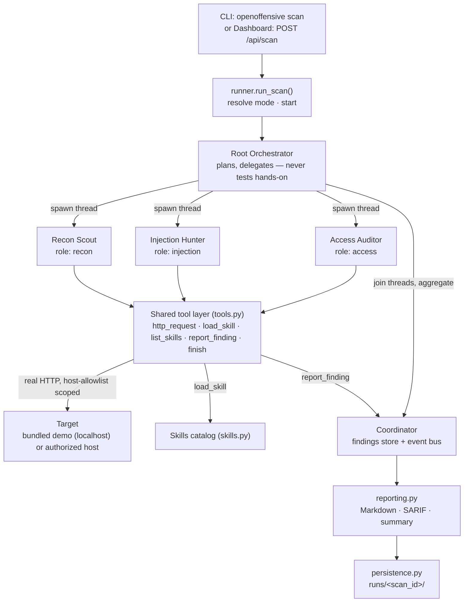
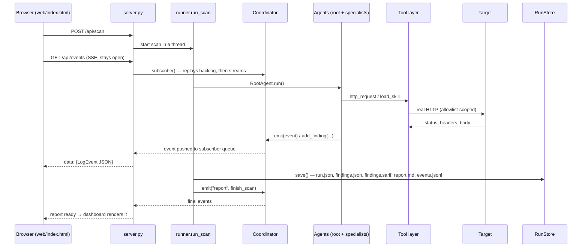
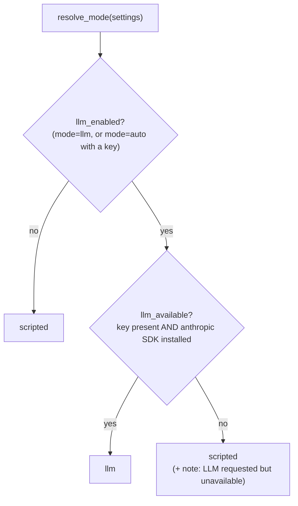

# Architecture

OpenOffensive is a small, readable implementation of an autonomous pentest engine. A
**root orchestrator** plans an engagement and delegates to **specialist sub-agents**
that run in parallel. Each specialist loads skills, drives a shared **tool layer** that
makes real HTTP requests, and files **validated findings** into a shared
**coordinator** — which is also the event bus the live dashboard reads. When the run
finishes, the findings become a Markdown report, a SARIF file, and a persisted record.

## Attribution

The architecture references the open-source **Strix** project
([github.com/usestrix/strix](https://github.com/usestrix/strix)) — a multi-agent
coordinator, a graph of delegating agents, a sandboxed tool layer, a load-on-demand
skills library, validated findings with CVSS, and a local run viewer. OpenOffensive
re-implements those ideas at proof-of-concept scale, in its own code, so they are easy
to follow end to end. This is the single Strix attribution in the project; everything
else is OpenOffensive's own work.

## The agent graph and scan flow

The root spawns each specialist as its own daemon **thread**, waits on all of them
(`wait_for_agents`), then aggregates. Because they are real threads sharing one
coordinator, their log lines interleave — the live log is a faithful trace of
concurrent work, not a scripted animation.

## The request and data flow across components

This is one scan viewed through the dashboard, showing how events reach the browser
over Server-Sent Events (SSE) while artifacts are written to disk.

The headless CLI path is the same minus the browser: `cli.py` subscribes to the
coordinator directly and prints each event to stdout as it arrives.

## Component-by-component walkthrough

Every module maps to one responsibility.

| Module | Responsibility |
| --- | --- |
| `openoffensive/__init__.py` | Package exports (`Coordinator`, `Finding`, `run_scan`, `Settings`, …) and `__version__`. |
| `openoffensive/__main__.py` | Makes `python -m openoffensive …` run the CLI. |
| `config.py` | `Settings` (a frozen dataclass) and `load_settings()`, resolved entirely from environment variables. Also `Settings.llm_enabled`. |
| `models.py` | The shared records: `LogEvent`, `AgentState`, `Finding`, `ScanConfig`, `ScanResult`, plus the `SEVERITY_CVSS` map and event `LEVELS`. |
| `coordinator.py` | The `Coordinator` — the single owner of run state: event log, agent graph, findings store, and the pub/sub queues that feed live subscribers. Thread-safe. |
| `tools.py` | The tool layer: `ToolContext` (the per-agent handle), the `Tool` dataclass, the `REGISTRY`, and `execute()`. One registry, shared by both run modes. |
| `skills.py` | The `CATALOG` of skill playbooks and `load()` / `describe_catalog()` — pentesting knowledge as data. |
| `llm.py` | The optional model brain: `run_agent_llm()` runs one agent under model control in a manual tool-use loop; `llm_available()` reports whether a real call can be made. |
| `agents.py` | `BaseAgent`, the three specialists (`ReconAgent`, `InjectionAgent`, `AccessAgent`), the `SPECIALISTS` registry, and `RootAgent`. |
| `reporting.py` | Turns the findings store into deliverables: `build_markdown()`, `build_sarif()`, `summary()`, and `to_result()`. |
| `persistence.py` | `RunStore` — writes each run to `runs/<scan_id>/` and reads runs, events, and reports back for history. |
| `runner.py` | `resolve_mode()` and `run_scan()` — top-level orchestration: pick the mode, run the root agent, build the result, persist. |
| `cli.py` | The `openoffensive` command: `scan`, `serve`, `list`, `report`, with CI-friendly exit codes. |
| `server.py` | The dashboard HTTP server: serves the single-page UI, streams the live log over SSE, exposes a small REST API, and boots the demo target. Pure standard library. |
| `demo_target.py` | "Juice-Box", the bundled, intentionally vulnerable demo app the agents test. Localhost-only. |
| `web/index.html` | The single-page dashboard: agent graph, findings, live log, mode badge, run-history dropdown, and the report modal. |

### The Coordinator and event model

The `Coordinator` is the heart of a run. It owns:

- **an event log** — an ordered list of `LogEvent`s, each with a monotonic `seq`, a
  `level` (one of `system`, `phase`, `think`, `skill`, `tool`, `finding`, `graph`,
  `report`, `error`), the emitting agent, and a message plus structured `data`;
- **the agent graph** — `AgentState` nodes (root and its children) with live status
  (`spawning` → `running` → `waiting` → `done` / `stopped`);
- **the findings store** — a list of `Finding`s, de-duplicated on `(title, endpoint)`
  and auto-assigned `VULN-0001`-style IDs;
- **pub/sub** — each live viewer (an SSE client, or the CLI streamer) gets its own
  thread-safe queue via `subscribe()`; on subscribe, the existing backlog is replayed
  so a late-joining browser catches up, then new events stream in.

Every agent interacts with the target and with each other **only** by emitting events
here (`emit(...)`, `add_finding(...)`, `set_status(...)`). That is what makes the live
log a trustworthy trace: there is no side channel. The coordinator takes a lock on
every mutation because agents run on their own threads while the HTTP server reads
snapshots on request threads.

A small `bill()` meter accrues "turns" and "cost" so the UI can show the budget idea a
real engine relies on. In scripted mode this is a nominal per-request charge; in LLM
mode it is computed from real token usage.

### The tool layer

A tool is a **name + JSON schema + handler**. The same `REGISTRY` backs both run modes:
the scripted specialists call handlers in a fixed order, and the LLM loop calls them by
name with the model's arguments. The registry:

| Tool | Purpose | Required arguments |
| --- | --- | --- |
| `http_request` | Send a real HTTP request to an in-scope endpoint; get status, selected headers, and body back. | `path` (plus optional `method`, `params`) |
| `report_finding` | File a validated vulnerability with evidence, a PoC, and a fix. | `title`, `severity`, `endpoint`, `evidence`, `remediation` (optional `cwe`, `poc`) |
| `load_skill` | Load a knowledge pack for a vuln class before testing it. | `name` |
| `list_skills` | List available skill playbooks. | — |
| `finish` | End the agent's work with a short summary. | `summary` (optional) |

Every HTTP call runs through `ToolContext`, which holds an **allowlist** built from the
target host plus any hosts an operator explicitly authorized via `OPENOFFENSIVE_SCOPE`.
A request to any other host is **blocked and logged** — it never leaves the process.
Handlers never raise into the agent loop: a failed probe or a bad argument comes back
as text, so one dead call cannot crash a run.

### Skills

Skills are pentesting know-how kept as data, not control flow. `skills.CATALOG` maps a
name to `(one-line description, playbook body)`. An agent advertises what it knows,
`list_skills` describes the catalog, and `load_skill` pulls a playbook's full text —
always *before* the agent acts, so the live log shows the knowledge step that precedes
the probes. The bundled catalog covers `reconnaissance`, `security_headers`,
`sql_injection`, `xss`, `idor`, and `severity_calibration`.

### Findings and reporting

A `Finding` carries a title, severity, target, endpoint, evidence, remediation,
emitting agent, an optional CWE, and an optional PoC. Its CVSS base score is derived
from severity via `SEVERITY_CVSS` (critical 9.4, high 7.8, medium 5.6, low 3.3, info
0.0) — an honest, simple mapping the UI ranks on; a production engine would compute a
full CVSS vector. `reporting.py` renders the store as:

- a **Markdown report** ordered by CVSS, and
- a **SARIF 2.1.0** document (`build_sarif`) — one rule per CWE/title, results mapped to
  SARIF levels (`critical`/`high` → `error`, `medium` → `warning`, `low`/`info` →
  `note`), with `security-severity` set from CVSS — ready for code-scanning ingestion.

### Persistence

`RunStore` writes every run to `runs/<scan_id>/` with atomic writes:

| Artifact | Contents |
| --- | --- |
| `run.json` | The `ScanResult` record: status, counts, turns, cost, duration, top severity, and the embedded Markdown report. |
| `findings.json` | The findings array. |
| `findings.sarif` | SARIF 2.1.0 for CI / code-scanning ingestion. |
| `report.md` | The human-readable report. |
| `events.jsonl` | The full live-log event stream, one JSON object per line — enough to replay the run. |

The dashboard's history dropdown and the `openoffensive list` / `report` commands read
straight from this directory, so results survive the process.

## The two run modes

The mode is resolved once per scan by `runner.resolve_mode(settings)`, which reads
`Settings.llm_enabled` (derived from `OPENOFFENSIVE_LLM_MODE` — `auto`, `llm`, or
`scripted` — and whether `ANTHROPIC_API_KEY` is present):

**Scripted mode** (default, zero dependencies, no API key). Each specialist runs a
fixed, auditable methodology in `scripted()` — a known sequence of `http_request` and
`report_finding` calls. It is deterministic and fully offline except for the HTTP
requests to the target itself. This is what makes the project a good teaching artifact:
the "AI reasoning" is legible and reproducible.

**LLM mode** (optional: `pip install 'openoffensive[llm]'` + `ANTHROPIC_API_KEY`).
Each specialist is handed a system prompt, its focus area, and the tool set, and a real
model decides what to probe and what to report. `llm.py` runs a **manual tool-use
loop**: it calls `client.messages.create(...)` with the tool schemas; for each response
it turns text blocks into `think` events and executes each `tool_use` block through the
same shared registry, feeding the results back as `tool_result` blocks; it stops when
the model calls `finish`, or when it hits the per-agent step budget
(`OPENOFFENSIVE_MAX_STEPS`). A `refusal` stop reason ends that agent cleanly. Every tool
call still flows through the same registry, so it is logged and scope-guarded exactly
like scripted mode — which makes the two modes directly comparable. The default model is
`claude-opus-5`, overridable via `OPENOFFENSIVE_MODEL` or `--model`.

Two important details:

- **The root always orchestrates, in both modes.** `RootAgent.work()` is overridden to
  plan, spawn specialists, wait, and aggregate — it never runs the LLM loop or the
  scripted methodology itself. Only the specialists run in the resolved mode.
- **There is a per-agent safety net.** If LLM mode was resolved but the SDK or key
  disappears at runtime, a specialist catches `LLMUnavailable` and falls back to its
  scripted methodology, so a run still produces results.

## Interfaces

- **CLI** (`cli.py`) — `openoffensive scan | serve | list | report` (or
  `python -m openoffensive …`). `scan` streams the live log to stdout and returns a
  CI-friendly exit code: `0` clean, `1` error, `2` findings.
- **Dashboard** (`server.py` + `web/index.html`) — started with `openoffensive serve`
  or `./run.sh`. A single-page UI with the agent graph, findings, and a live log fed by
  SSE (`GET /api/events`), plus a mode badge and a run-history dropdown backed by
  `GET /api/runs`. A scan is kicked off with `POST /api/scan` (one at a time). The
  server also boots the bundled demo target so there is always something safe to scan.

See [USAGE.md](USAGE.md) for the full command and environment reference, and
[SECURITY.md](SECURITY.md) for the scope and authorization model.
