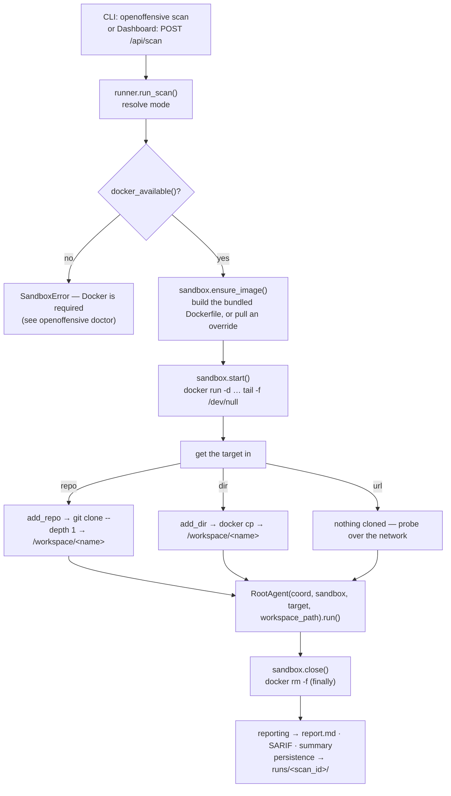
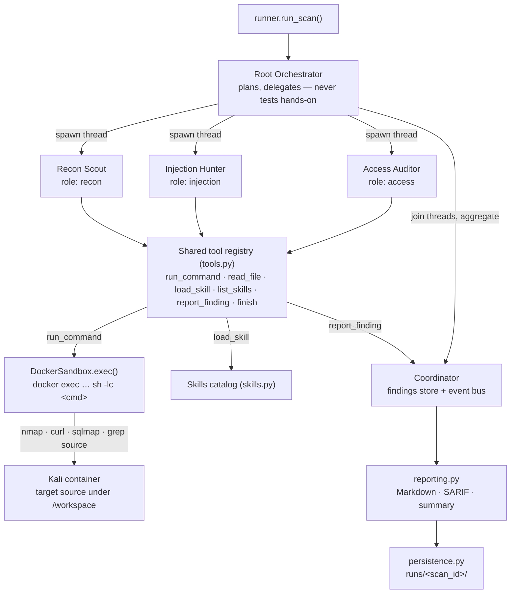
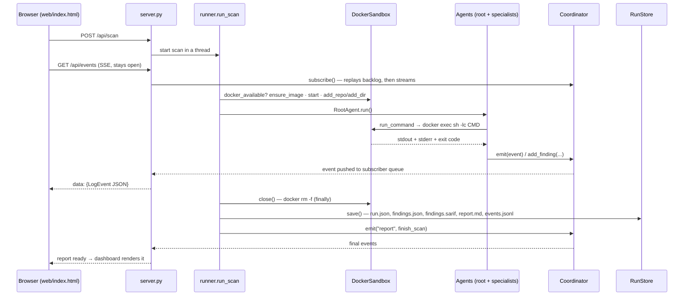
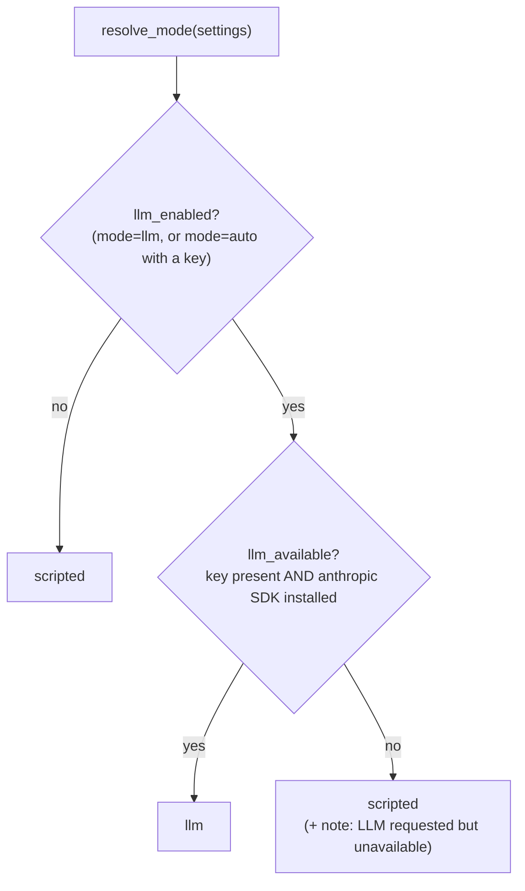

# Architecture

OpenOffensive is a small, readable implementation of an autonomous pentest engine that runs
each scan inside a **real Docker container**. The runner preflights Docker, builds or pulls a
**Kali sandbox image**, starts one keep-alive container for the scan, and gets the target's
source into it. A **root orchestrator** then plans the engagement and delegates to
**specialist sub-agents** that run in parallel; each drives a tool-use loop whose core tool,
`run_command`, executes shell commands **inside that container** via `docker exec`. Every
validated issue is filed into a shared **coordinator** — which is also the event bus the live
dashboard reads. When the run finishes, the container is torn down and the findings become a
Markdown report, a SARIF file, and a persisted record.

## Attribution

The architecture references the open-source **Strix** project
([github.com/usestrix/strix](https://github.com/usestrix/strix)) — a real Docker sandbox with
a Kali toolset into which the target is cloned, a multi-agent coordinator, a graph of
delegating agents that run tools inside the sandbox, a load-on-demand skills library,
validated findings with CVSS, and a local run viewer. OpenOffensive re-implements those ideas
at proof-of-concept scale, in its own code, so they are easy to follow end to end. This is the
single Strix attribution in the project; everything else is OpenOffensive's own work. A
source-level analysis of Strix is kept as reference reading in
[reference/strix-architecture.md](reference/strix-architecture.md).

## The scan lifecycle

`runner.run_scan()` owns the lifecycle. Unless a sandbox is injected (tests pass a
`FakeSandbox`), it creates a real Docker sandbox and requires a running daemon.

The container is created once per scan and removed in a `finally`, so a crash still tears it
down. `classify_target()` decides how the target gets in: a git URL (ends `.git`, starts
`git@`, or a `github.com` / `gitlab.com` / `bitbucket.org` repo path) is cloned; an existing
local directory is copied; anything else is treated as a live URL to probe black-box, with no
source in the container.

## The agent graph

The root spawns each specialist as its own daemon **thread**, waits on all of them
(`wait_for_agents`), then aggregates. Because they are real threads sharing **one container**
and one coordinator, their tool calls interleave against the same box — the live log is a
faithful trace of concurrent work, not a scripted animation.

## The request and data flow across components

One scan viewed through the dashboard: how events reach the browser over Server-Sent Events
(SSE) while every tool call runs inside the container and artifacts are written to disk.

The headless CLI path is the same minus the browser: `cli.py` subscribes to the coordinator
directly and prints each event to stdout as it arrives.

## Component-by-component walkthrough

Every module maps to one responsibility.

| Module | Responsibility |
| --- | --- |
| `openoffensive/__init__.py` | Package exports (`Coordinator`, `Finding`, `run_scan`, `Settings`, …) and `__version__`. |
| `openoffensive/__main__.py` | Makes `python -m openoffensive …` run the CLI. |
| `config.py` | `Settings` (a frozen dataclass) and `load_settings()`, resolved entirely from environment variables. Includes the sandbox image/network and `Settings.llm_enabled`. |
| `models.py` | The shared records: `LogEvent`, `AgentState`, `Finding`, `ScanConfig`, `ScanResult`, plus the `SEVERITY_CVSS` map and event `LEVELS`. |
| `coordinator.py` | The `Coordinator` — the single owner of run state: event log, agent graph, findings store, and the pub/sub queues that feed live subscribers. Thread-safe. |
| `sandbox/` | The Docker sandbox runtime — see the table below. |
| `tools.py` | The tool layer: `ToolContext` (the per-agent handle onto the shared sandbox and in-scope target), the `Tool` dataclass, the `REGISTRY`, and `execute()`. One registry, shared by both run modes. |
| `skills.py` | The `CATALOG` of skill playbooks and `load()` / `describe_catalog()` — pentesting knowledge as data. |
| `llm.py` | The optional model brain: `run_agent_llm()` runs one agent under model control in a manual tool-use loop; `llm_available()` reports whether a real call can be made. |
| `agents.py` | `BaseAgent`, the three specialists (`ReconAgent`, `InjectionAgent`, `AccessAgent`), the `SPECIALISTS` registry, and `RootAgent`. |
| `reporting.py` | Turns the findings store into deliverables: `build_markdown()`, `build_sarif()`, `summary()`, and `to_result()`. |
| `persistence.py` | `RunStore` — writes each run to `runs/<scan_id>/` and reads runs, events, and reports back for history. |
| `runner.py` | `resolve_mode()`, `classify_target()`, and `run_scan()` — top-level orchestration: pick the mode, preflight Docker, open/start the sandbox, get the target in, run the root agent, tear down, persist. |
| `cli.py` | The `openoffensive` command: `scan`, `doctor`, `serve`, `list`, `report`, with CI-friendly exit codes. |
| `server.py` | The dashboard HTTP server: serves the single-page UI, streams the live log over SSE, exposes a small REST API, and boots the demo target on `0.0.0.0` (so the scan container can reach it). Pure standard library. |
| `demo_target.py` | "Juice-Box", the bundled, intentionally vulnerable demo app the agents test. |
| `web/index.html` | The single-page dashboard: agent graph, findings, live log, mode badge, run-history dropdown, and the report modal. |

### The sandbox package

`openoffensive/sandbox/` is the piece that makes OpenOffensive behave like Strix.

| File | Responsibility |
| --- | --- |
| `sandbox/__init__.py` | The public surface: `docker_available()` (preflight — is the daemon usable right now?), `open_sandbox()` (construct the per-scan `DockerSandbox` from settings), `SANDBOX_DIR` (where the Dockerfile lives), and the exported types. |
| `sandbox/docker.py` | `DockerSandbox` — one Kali container per scan, driven by shelling out to the `docker` CLI (no docker-py dependency). Owns `ensure_image()` (build the bundled Dockerfile for the default local tag, or `docker pull` an override), `start()` (`docker run -d … tail -f /dev/null`), `exec()` (`docker exec -w <wd> sh -lc <cmd>` → `ExecResult`), `add_repo()` / `add_dir()`, `read_file()`, and `close()` (`docker rm -f`). |
| `sandbox/fake.py` | `FakeSandbox` — an in-memory stand-in with the same interface, for tests. `exec()` answers from a rules map and records every command in `.calls`; the lifecycle methods are no-ops. No Docker involved. |
| `sandbox/Dockerfile` | The image `openoffensive-sandbox:kali`, built from `kalilinux/kali-rolling` with a focused toolset: `nmap`, `sqlmap`, `nikto`, `whatweb`, `dirb`, `gobuster`, `wafw00f`, `curl`, `wget`, `git`, `python3`, `jq`, `dnsutils`, `netcat`. |

The container is started with `--add-host host.docker.internal:host-gateway` (so it can reach
a service on the host, such as the bundled demo) and `--cap-add NET_ADMIN --cap-add NET_RAW`
(so tools like `nmap` work). An `ExecResult` carries `stdout`, `stderr`, `exit_code`, and a
`timed_out` flag; `.combined()` is the trimmed stdout+stderr the agent sees back from a call.

### The Coordinator and event model

The `Coordinator` is the heart of a run. It owns:

- **an event log** — an ordered list of `LogEvent`s, each with a monotonic `seq`, a `level`
  (one of `system`, `phase`, `think`, `skill`, `tool`, `finding`, `graph`, `report`,
  `error`), the emitting agent, and a message plus structured `data`;
- **the agent graph** — `AgentState` nodes (root and its children) with live status
  (`spawning` → `running` → `waiting` → `done` / `stopped`);
- **the findings store** — a list of `Finding`s, de-duplicated on `(title, endpoint)` and
  auto-assigned `VULN-0001`-style IDs;
- **pub/sub** — each live viewer (an SSE client, or the CLI streamer) gets its own thread-safe
  queue via `subscribe()`; on subscribe, the existing backlog is replayed so a late-joining
  browser catches up, then new events stream in.

Every agent interacts with the container and with each other **only** by emitting events here
(`emit(...)`, `add_finding(...)`, `set_status(...)`). That is what makes the live log a
trustworthy trace: there is no side channel. The coordinator takes a lock on every mutation
because agents run on their own threads while the HTTP server reads snapshots on request
threads. A small `bill()` meter accrues "turns" and "cost" so the UI can show the budget idea
a real engine relies on; in scripted mode this is a nominal per-command charge, and in LLM
mode it is computed from real token usage.

### The tool layer

A tool is a **name + JSON schema + handler**. The same `REGISTRY` backs both run modes: the
scripted specialists call the tools in a fixed order, and the LLM loop calls them by name with
the model's arguments. Every tool receives a `ToolContext`, which holds the shared
**sandbox** and the in-scope **target**; `ctx.run(command)` calls `sandbox.exec()` and logs
the command and its result as a `tool` event.

| Tool | Purpose | Required arguments |
| --- | --- | --- |
| `run_command` | Run a shell command **inside the container** (nmap, curl, sqlmap, nikto, gobuster, whatweb, python3, or grep the source under `/workspace`); returns combined stdout+stderr and the exit code. | `command` (optional `timeout`, default 180s, max 600) |
| `read_file` | Read a file inside the container — a convenience wrapper over `cat`. | `path` |
| `report_finding` | File a validated vulnerability with evidence, a PoC, and a fix. | `title`, `severity`, `endpoint`, `evidence`, `remediation` (optional `cwe`, `poc`) |
| `load_skill` | Load a knowledge pack for a vuln class before testing it. | `name` |
| `list_skills` | List available skill playbooks. | — |
| `finish` | End the agent's work with a short summary. | `summary` (optional) |

Handlers never raise into the agent loop: a failed command, a timeout, or a bad argument comes
back as text, so one dead call cannot crash a run. There is no host allowlist and no host-side
HTTP tool — isolation comes from the container itself, and the agents are instructed to touch
only the in-scope target (see [SECURITY.md](SECURITY.md)).

### Skills

Skills are pentesting know-how kept as data, not control flow. `skills.CATALOG` maps a name to
`(one-line description, playbook body)`. An agent advertises what it knows, `list_skills`
describes the catalog, and `load_skill` pulls a playbook's full text — always *before* the
agent acts, so the live log shows the knowledge step that precedes the commands. The bundled
catalog covers `reconnaissance`, `security_headers`, `sql_injection`, `xss`, `idor`, and
`severity_calibration`.

### Findings and reporting

A `Finding` carries a title, severity, target, endpoint, evidence, remediation, emitting
agent, an optional CWE, and an optional PoC. Its CVSS base score is derived from severity via
`SEVERITY_CVSS` (critical 9.4, high 7.8, medium 5.6, low 3.3, info 0.0) — an honest, simple
mapping the UI ranks on; a production engine would compute a full CVSS vector. `reporting.py`
renders the store as:

- a **Markdown report** ordered by CVSS, and
- a **SARIF 2.1.0** document (`build_sarif`) — one rule per CWE/title, results mapped to SARIF
  levels (`critical`/`high` → `error`, `medium` → `warning`, `low`/`info` → `note`), with
  `security-severity` set from CVSS — ready for code-scanning ingestion.

### Persistence

`RunStore` writes every run to `runs/<scan_id>/` with atomic writes:

| Artifact | Contents |
| --- | --- |
| `run.json` | The `ScanResult` record: status, counts, turns, cost, duration, top severity, and the embedded Markdown report. |
| `findings.json` | The findings array. |
| `findings.sarif` | SARIF 2.1.0 for CI / code-scanning ingestion. |
| `report.md` | The human-readable report. |
| `events.jsonl` | The full live-log event stream, one JSON object per line — enough to replay the run. |

The dashboard's history dropdown and the `openoffensive list` / `report` commands read
straight from this directory, so results survive the process.

## The two run modes

Both modes run **inside the same container** and use **the same tools** — the difference is
only *who decides the next command*. The mode is resolved once per scan by
`runner.resolve_mode(settings)`, which reads `Settings.llm_enabled` (derived from
`OPENOFFENSIVE_LLM_MODE` — `auto`, `llm`, or `scripted` — and whether `ANTHROPIC_API_KEY` is
present):

**Scripted mode** (default, no API key). Each specialist runs a fixed, auditable methodology
in `scripted()` — a known sequence of real `run_command`s in the container (`curl` the target,
`grep` the cloned source, walk sequential API ids) followed by `report_finding` when the
output confirms an issue. It is deterministic, and the "AI reasoning" is legible and
reproducible. It still needs Docker: the commands run in the Kali box.

**LLM mode** (optional: `pip install 'openoffensive[llm]'` + `ANTHROPIC_API_KEY`). Each
specialist is handed a system prompt, its focus area, and the tool set, and a real model
decides what to run and what to report. `llm.py` runs a **manual tool-use loop**: it calls
`client.messages.create(...)` with the tool schemas; for each response it turns text blocks
into `think` events and executes each `tool_use` block through the same shared registry
(`run_command` → `docker exec`), feeding the results back as `tool_result` blocks; it stops
when the model calls `finish`, or when it hits the per-agent step budget
(`OPENOFFENSIVE_MAX_STEPS`). A `refusal` stop reason ends that agent cleanly. Because every
action flows through the same registry and the same container, the two modes are directly
comparable. The default model is `claude-opus-5`, overridable via `OPENOFFENSIVE_MODEL` or
`--model`.

Two important details:

- **The root always orchestrates, in both modes.** `RootAgent.work()` is overridden to plan,
  spawn specialists, wait, and aggregate — it never runs the LLM loop or a scripted
  methodology itself. Only the specialists run in the resolved mode.
- **There is a per-agent safety net.** If LLM mode was resolved but the SDK or key disappears
  at runtime, a specialist catches `LLMUnavailable` and falls back to its scripted methodology,
  so a run still produces results.

## Interfaces

- **CLI** (`cli.py`) — `openoffensive scan | doctor | serve | list | report` (or
  `python -m openoffensive …`). `scan` streams the live log to stdout and returns a
  CI-friendly exit code: `0` clean, `1` error, `2` findings. `doctor` reports Docker and LLM
  readiness and, with `--build`, pre-builds the sandbox image.
- **Dashboard** (`server.py` + `web/index.html`) — started with `openoffensive serve` or
  `./run.sh`. A single-page UI with the agent graph, findings, and a live log fed by SSE
  (`GET /api/events`), plus a mode badge and a run-history dropdown backed by `GET /api/runs`.
  A scan is kicked off with `POST /api/scan` (one at a time); it runs in a container exactly
  like the CLI path, so the dashboard also needs Docker. The server boots the bundled demo on
  `0.0.0.0` and points the scan at `host.docker.internal` so the container can reach it.

See [USAGE.md](USAGE.md) for the full command and environment reference, and
[SECURITY.md](SECURITY.md) for the isolation and authorization model.
