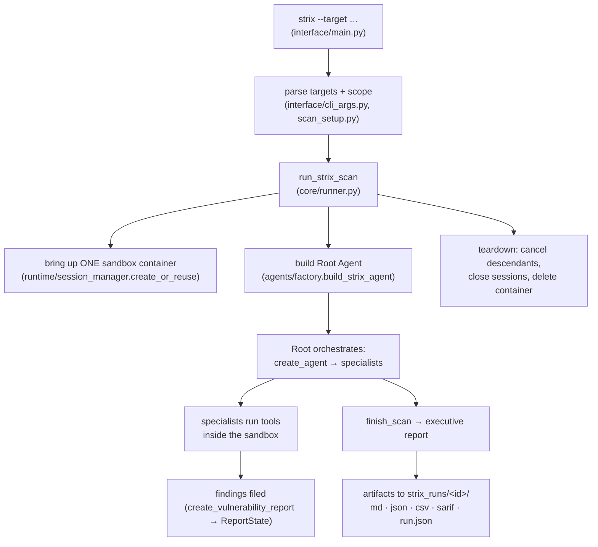
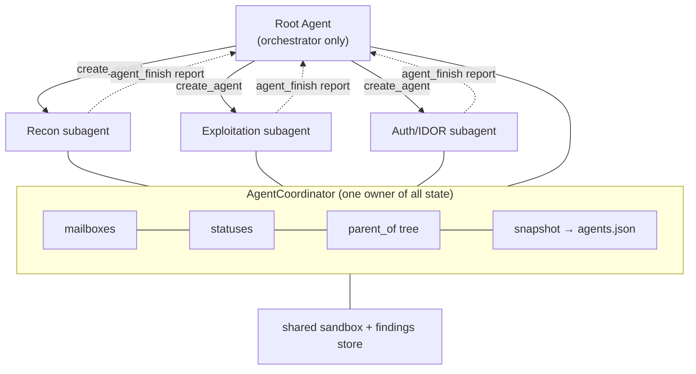
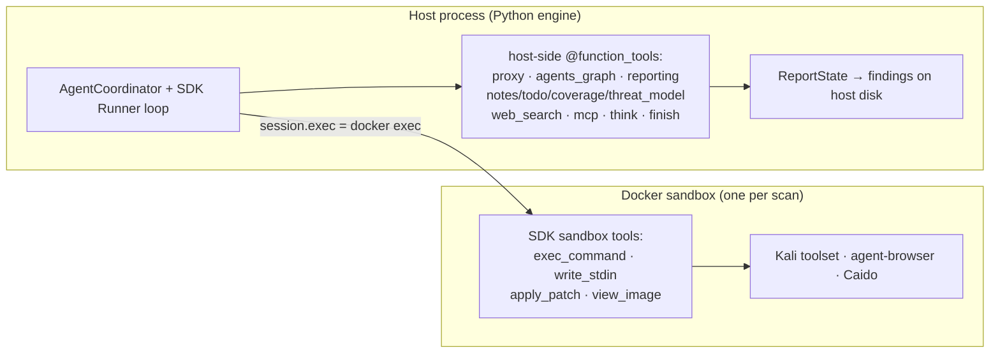
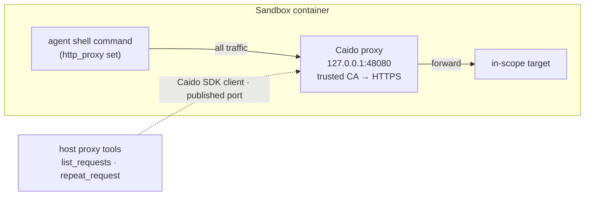

# How Strix Works — A Comprehensive Architecture Reference

> **What this is.** A deep, source-level analysis of the upstream open-source project
> **Strix** ([github.com/usestrix/strix](https://github.com/usestrix/strix),
> analyzed at **v1.5.3**, Apache-2.0). OpenOffensive's architecture *references* Strix;
> this document exists so contributors understand the real system the miniature is
> modeled on. It is reference material about a separate project — not OpenOffensive
> itself. Module paths below (`strix/...`) refer to the Strix repository.

---

## Table of contents

1. [What Strix is](#1-what-strix-is)
2. [The foundation: OpenAI Agents SDK + LiteLLM](#2-the-foundation-openai-agents-sdk--litellm)
3. [The scan lifecycle, end to end](#3-the-scan-lifecycle-end-to-end)
4. [The multi-agent graph (AgentCoordinator)](#4-the-multi-agent-graph-agentcoordinator)
5. [The agent execution loop](#5-the-agent-execution-loop)
6. [The agent factory](#6-the-agent-factory)
7. [Tools — two execution planes](#7-tools--two-execution-planes)
8. [The sandbox (Docker/Kali + Caido)](#8-the-sandbox-dockerkali--caido)
9. [Skills — knowledge as data](#9-skills--knowledge-as-data)
10. [The system prompt and methodology](#10-the-system-prompt-and-methodology)
11. [Scope and targets](#11-scope-and-targets)
12. [Findings and reporting](#12-findings-and-reporting)
13. [Budgets and cost control](#13-budgets-and-cost-control)
14. [Context management](#14-context-management)
15. [Interfaces (CLI, TUI, web viewer)](#15-interfaces-cli-tui-web-viewer)
16. [Configuration, MCP, telemetry](#16-configuration-mcp-telemetry)
17. [Model support](#17-model-support)
18. [Source map](#18-source-map)
19. [The mental model](#19-the-mental-model)
20. [Appendix: how OpenOffensive maps to Strix](#20-appendix-how-openoffensive-maps-to-strix)

---

## 1. What Strix is

Strix is an **open-source autonomous AI penetration-testing tool**. It points a team of
AI agents at an application, has them **run the target dynamically**, find
vulnerabilities, and **validate each one with a working proof-of-concept** — then writes
up findings with remediation. The pitch is "AI hackers that behave like real
pentesters": dynamic exploitation and validation instead of the false positives of
static scanners.

It ships two ways, both the same engine:

- **Open-source CLI** (PyPI `strix-agent`) — free, fully local, bring-your-own LLM key,
  needs Docker. Best for local dev loops and air-gapped use.
- **Managed cloud** (`app.strix.ai`) — no Docker/key/install; adds dashboards,
  scheduling, PR reviews, and downloadable reports.

Key traits: a full offensive toolkit in a sandbox, **multi-agent orchestration**
(a "graph of agents"), validated findings with PoCs, a developer-first CLI, and
auto-fix + compliance-ready reporting.

---

## 2. The foundation: OpenAI Agents SDK + LiteLLM

The single most important fact: **Strix is not a from-scratch agent framework.** It is a
pentesting-specialized layer built on the **OpenAI Agents SDK** (the `agents` package,
pinned `openai-agents[litellm]>=0.19.0,<0.20`) plus its sandbox extension
(`agents.sandbox`). The SDK supplies:

- the agent object (`SandboxAgent`), the run loop (`Runner.run_streamed`), streaming,
  tool-calling, sessions (`SQLiteSession`), and lifecycle hooks (`RunHooks`);
- the **sandbox capabilities** (`Filesystem`, `Shell`) that expose file-edit and shell
  tools which execute *inside* a container.

Strix supplies the security domain on top: the pentesting tools, the knowledge (skills),
the multi-agent coordinator, the sandbox image, and the reporting pipeline.

Because model calls route through **LiteLLM**, Strix is **model-agnostic**: OpenAI,
Anthropic, Google Vertex, Amazon Bedrock, Azure, OpenRouter, or a local OpenAI-compatible
endpoint all work by setting `STRIX_LLM` and a key. Other notable dependencies:
`docker` (sandbox), `caido-sdk-client` (proxy), `cvss` (scoring), `reportlab`/`pypdf`
(PDF reports), `rich` (CLI). Python 3.12+. The CLI entry point is
`strix.interface.main:main`.

---

## 3. The scan lifecycle, end to end

Running `strix --target <x>` flows through `strix.core.runner.run_strix_scan`, which
orchestrates the whole engagement:

Concretely, `run_strix_scan`:

1. Creates a run directory `strix_runs/<scan_id>/` and a state dir, sets up logging.
2. **Detects resume** — if `agents.json` exists, it restores the coordinator snapshot and
   the SDK session DB (`agents.db`) and re-spawns sub-agents.
3. Loads settings, resolves the LLM model, and creates an `AgentCoordinator`.
4. **Hydrates persisted tool state** from disk (todos, notes, coverage, threat models),
   so a resumed run keeps its working memory.
5. Brings up the sandbox via `session_manager.create_or_reuse`, which returns a bundle:
   `{session, client, caido_client}`.
6. Configures a **spill writer** (oversized tool output is written to a file in the
   sandbox workspace instead of flooding the model's context).
7. Builds the SDK `RunConfig` — model, `StrixProvider`, model settings, and crucially
   `SandboxRunConfig(client=…, session=…)` so the SDK's sandbox tools operate Strix's
   container. `tool_not_found_behavior="return_error_to_model"` makes a hallucinated tool
   name a recoverable mistake, not a crash.
8. Connects any **MCP servers** (from `~/.strix/mcp-servers.json` or supplied requests).
9. Builds the **root agent**, registers it, wires a child-agent factory and a `context`
   dict that every tool reads from.
10. Runs `run_agent_loop` for the root agent.
11. On finish, checks that `finish_scan` actually ran (`scan_completed`).
12. **Teardown** in `finally`: cancel descendant agents, close sessions, close MCP
    sessions, snapshot, and delete the sandbox container.

---

## 4. The multi-agent graph (AgentCoordinator)

The heart of Strix is `strix/core/agents.py`'s **`AgentCoordinator`** — "the single owner
for graph state, SDK runtimes, messages, and resume snapshots." Agents are
**addressable**: anyone (a peer agent, or the human) can send a message to any agent by
its id.

What the coordinator holds and does:

- **State maps** — `statuses`, `parent_of`, `names`, `metadata` (task + skills), and
  `runtimes`. Each `AgentRuntime` carries the agent's SDK `session`, its asyncio `task`,
  its live `stream`, a **mailbox** (`list[dict]`), a `wake` event, and flags like
  `interrupt_on_message` and `user_wake_required`.
- **Statuses**: `running`, `waiting`, `completed`, `stopped`, `crashed`, `failed`,
  `budget_paused`. A `WaitKind` (`user` / `agents` / `stalled`) records *why* an agent
  parked, which controls whether it is re-checked on a timer.
- **Message passing** — `send(target, message)` appends to the target's mailbox, wakes it,
  and (optionally) **interrupts its in-flight model turn** (`stream.cancel`). Messages
  become user-role items in the target's SDK session (`consume_pending` /
  `_message_to_session_item`). This is how the root delegates, how children report back,
  and how a human steers a live agent.
- **Resume snapshots** — on *every* mutation the whole graph is serialized atomically to
  `agents.json` (`_maybe_snapshot`). Combined with the SDK's `agents.db` session store,
  this makes a crashed or paused scan resumable with `strix --resume`.
- **Budget coordination** — scan-wide budget stop, interactive budget pause, and a
  sub-agent budget reserve, each able to wake every parked agent so it exits cleanly.
- **Graceful shutdown** — `cancel_descendants` / `cancel_descendants_graceful` stop a
  subtree leaves-first.

---

## 5. The agent execution loop

Each agent runs an async loop in `strix/core/execution.py`, built around the SDK's
`Runner.run_streamed`. The defining rule:

> **Plain text never ends a turn — only a lifecycle tool does.**

`_run_until_lifecycle` drives an agent until an explicit lifecycle tool settles its
status. The lifecycle tools are:

| Tool | Meaning |
|---|---|
| `finish_scan` | root only — the whole engagement is done; writes the report |
| `agent_finish` | a sub-agent is done; posts a completion report to its parent |
| `respond_to_user` | interactive — answer the human **and** park for their reply |
| `wait_for_agents` | block until a child/peer sends something back |

A turn that ends on plain text leaves the agent `running`; the loop **nudges it back into
a tool call**, bounded by a recovery limit (3 in interactive mode). This removes a whole
class of failure where a model says "scan complete" and stops without producing anything
— the report only exists because it flows *through* `finish_scan`.

Around this core, `_run_cycle` layers the machinery that keeps a long, expensive,
autonomous run alive:

- **Budget enforcement** — checks `budget_stopped` / `reserve_stopped` each turn; raises
  `BudgetExceededError` / `SubagentBudgetReservedError` / `BudgetPausedError`.
- **Context management** — proactive **compaction** of the SQLite session; **image budget**
  enforcement and **image stripping** on `400/404/422` input rejections; forced compaction
  on context overflow (up to 2 per cycle).
- **Resilience** — transient provider errors (timeouts, connection errors, retryable
  status codes via `litellm._should_retry`) **retry with exponential backoff** (up to 5);
  a crashed run's stream history is **salvaged** back into the session so a revived agent
  loses no context.
- **Two postures** — **interactive** runs *park* on error (a human can message any agent to
  resume); **non-interactive** (headless) runs *fail loudly*, so CI can gate on them.
- **Child spawning** — `spawn_child_agent` allocates a child id, builds a child agent via
  the runner-provided factory, registers it in the coordinator, opens its own SQLite
  session, and launches it as a detached `asyncio.create_task` — real in-process
  parallelism. `respawn_subagents` rebuilds the tree on resume.

---

## 6. The agent factory

`strix/agents/factory.py`'s `build_strix_agent` assembles a `SandboxAgent`:

- **Tools** = `_BASE_TOOLS` (a large tuple) + `_EXTRA_TOOLS` (backend-registered plugins)
  + the lifecycle tool (`finish_scan` for root, `agent_finish` for children) +
  `respond_to_user` in interactive mode.
  - `_BASE_TOOLS` includes: `think`, `load_skill`, the todo tools, the notes tools, the
    coverage tools, the threat-model tools, `web_search`, the reporting tools
    (`create_vulnerability_report`, `create_dependency_report`, `list_reports`,
    `get_report`), the proxy tools (`list_requests`, `view_request`, `repeat_request`,
    `list_sitemap`, `view_sitemap_entry`, `scope_rules`), the MCP tools (`list_mcps`,
    `describe_mcp`, `call_mcp`), and the agents-graph tools (`view_agent_graph`,
    `send_message_to_agent`, `wait_for_agents`, `create_agent`, `stop_agent`).
- **Capabilities** = the SDK's `Filesystem` and `Shell`, which *emit* the sandbox tools
  (`apply_patch`/`view_image`, and `exec_command`/`write_stdin`) bound to the run's
  container.
- **`tool_use_behavior = _finish_tool_use_behavior`** — the mechanism that makes the run
  continue until a lifecycle tool reports *success*; parking tools (`respond_to_user`,
  `wait_for_agents`) end the turn only in interactive mode.
- **Tool wrapping** (idempotent) — every function tool is wrapped to: **bound the result
  size** (spilling overflow to a sandbox file the agent can `grep`), **coerce sloppy model
  arguments** (JSON-in-a-string, nullish sentinels for query tools), **drop strict schema
  mode** for providers that can't take it, and **return exceptions as text** rather than
  crashing. There's also a Chat-Completions vs Responses adaptation for providers that
  use the older tool-schema shape.

`make_child_factory` captures scan-level configuration (scan mode, whitebox, diff scope,
interactive, prompt context) in a closure so every child inherits it without the
graph tool knowing runner internals.

---

## 7. Tools — two execution planes

Every capability is an SDK tool defined with the `@function_tool` decorator (there is no
custom registry — Strix reuses the SDK's, ~42 decorated functions). The tools split
cleanly across the **sandbox boundary**, and that split is the single most important thing
to understand about how Strix executes.

- **Host-side function tools** run in the Strix host process and read their dependencies
  (coordinator, sandbox session, Caido client, MCP registry, `spawn_child_agent`, scan
  targets) from the shared `context` dict. They **reason, coordinate, and record** — they
  never execute attacker code. This is the proxy inspection tools, the multi-agent
  graph tools, notes/todos/coverage/threat-models, the vulnerability reporting tools,
  `web_search` (Perplexity), the MCP dispatch tools, `think`, and the lifecycle tools.
- **Sandbox tools** run *inside* the container over the SDK sandbox session's
  `session.exec(...)` (which is `docker exec` under the hood). There is **no separate
  "Python tool"** — code execution *is* `exec_command` running `python3`, with
  `write_stdin` driving interactive processes (REPLs, `sqlmap`, `nc`, sending Ctrl-C).
  `apply_patch` (surfaced to the model as `patch`) is the first-class file editor;
  `view_image` loads a browser screenshot as a vision block.
- **agent-browser** is *not* a function tool: it's an npm CLI (`agent-browser`) baked into
  the image, driving Chromium via CDP, invoked through `exec_command`.
- **proxy** tools are host-side wrappers over **Caido** (below); the agent can also import
  `caido_api` inside sandbox Python for programmatic proxy automation.

Oversized tool results are truncated and spilled to `/workspace/.tool-output/<id>.txt` so
the agent can `grep`/`sed` the rest without blowing the context window.

---

## 8. The sandbox (Docker/Kali + Caido)

Each **scan** (not each agent) runs in a single Docker container, cached by `scan_id` in
`runtime/session_manager.py`; all of the scan's agents share it. It is created at scan
start and deleted at teardown.

**The image** (`containers/Dockerfile`, `ghcr.io/usestrix/strix-sandbox`) is a multi-stage
build on `kalilinux/kali-rolling` with a full pentest toolkit baked in:

- **scanners / fuzzers**: nmap, sqlmap, nuclei (+ templates), subfinder, naabu, ffuf,
  wapiti, arjun, dirsearch, wafw00f, plus Go tools (httpx, katana, gospider,
  interactsh-client, govulncheck, cvemap);
- **SAST / secrets**: semgrep, bandit, trufflehog, gitleaks, trivy, retire.js, eslint,
  jshint, ast-grep, tree-sitter;
- **browser**: Chromium + the `agent-browser` CLI (CDP);
- **languages**: a Python venv preloaded with requests/httpx/bs4/lxml/pyjwt/cryptography,
  plus Node and Go;
- **proxy**: caido-cli.

It runs as a non-root `pentester` user with passwordless sudo, adds `NET_ADMIN`/`NET_RAW`
so tools like `nmap -sS` can use raw sockets, generates a **self-signed "Testing Root CA"**
trusted system-wide and in the browser's NSS store, and maps `host.docker.internal` so the
agent can reach an app served on the host.

**How the host talks to the container**: there is no bespsoke API server inside. The host
Python process talks to the Docker daemon over docker-py; commands run *inside* the
container via the SDK sandbox session's `session.exec(...)` = `docker exec`. Every CLI the
agent runs (nmap, ffuf, `python3`, agent-browser) goes through that channel.

**HTTP interception via Caido**:

`docker-entrypoint.sh` starts `caido-cli` as a sidecar on `127.0.0.1:48080`, polls its
GraphQL for readiness, and writes proxy env (`http_proxy`/`https_proxy`/`ALL_PROXY =
http://127.0.0.1:48080`, `NO_PROXY=localhost,127.0.0.1`) system-wide — so every process
the agent spawns routes through Caido, and the trusted CA makes HTTPS interception
transparent. `runtime/caido_bootstrap.py` execs `curl` inside the box to get a guest
token, then builds a **host-side** `caido_sdk_client.Client` against the published port and
creates a sandbox project. All agents in a scan share one Caido client, serialized under a
lock.

**Pluggable backends**: `runtime/backends.py` is a registry keyed by
`STRIX_RUNTIME_BACKEND` (default `docker`). A `supports_bind_mounts` flag drives a real
branch — Docker mounts host source trees directly, while a non-bind-mount (remote) backend
receives local sources as manifest entries to upload. So the abstraction genuinely
anticipates a non-Docker runtime.

---

## 9. Skills — knowledge as data

Strix's pentesting expertise lives in **skills**: Markdown files with a little YAML
frontmatter (`name`, `description`), under `strix/skills/`. They are the difference between
an agent that can run `sqlmap` and one that knows the union/blind/error-based playbook and
DBMS-specific quirks.

Two loading paths, both through `strix/agents/prompt.py`:

- **Preloaded at spawn** — `_resolve_skills` builds an ordered, always-on set appended to
  whatever the caller requested: `scan_modes/<mode>`, `tooling/agent_browser`,
  `tooling/python`, `analysis/counterevidence`, `analysis/severity_calibration`, plus
  `coordination/root_agent` for the root and several whitebox skills when source is
  present. Their bodies are inlined into the ~47 KB Jinja system prompt.
- **Lazy via a catalog** — the prompt also injects `available_skills` (names + one-line
  descriptions only). When an agent hits a class it needs, it calls the **`load_skill`
  tool** to pull the full body inline (max 5 at a time). The root can also *permanently*
  assign skills to a child by passing `skills=[…]` to `create_agent`.

**Taxonomy** (representative counts): `vulnerabilities/` (~29 — sql_injection, xss, ssrf,
idor, rce, xxe, ssti, race_conditions, llm_prompt_injection…), `tooling/` (~13 — nmap,
nuclei, ffuf, sqlmap, semgrep, katana, and the always-on agent_browser and python),
`technologies/` (supabase, firebase, auth0, electron…), `cloud/` (aws, azure, gcp,
kubernetes), `frameworks/` (django, fastapi, nestjs, nextjs), `analysis/` (counterevidence,
severity_calibration, fix_verification, source_aware_discovery), `scan_modes/` (quick,
standard, deep, diff), `reconnaissance/`, `protocols/` (graphql, oauth), `coordination/`,
`custom/`. `scan_modes`, `coordination`, and `analysis` are internal — wired in
automatically and not shown in the agent-facing catalog.

**Scan modes are skills.** `--scan-mode quick|standard|deep` (default `deep`) is just the
methodology skill injected into every agent — it changes breadth vs depth, not the
toolset. `quick` is time-boxed; `deep` is exhaustive; `diff` is a separate overlay for
change-scoped (PR) runs.

> Note: the top-level `skills/` directory in the repo is a *different* thing — consumer
> `SKILL.md` packages that teach external coding agents (Claude Code, Cursor, Codex) how to
> *drive* Strix. The internal `strix/skills/` packs are consumed *by* Strix's own agents.

---

## 10. The system prompt and methodology

The behavior of the agents is encoded in `strix/agents/prompts/system_prompt.jinja` (~47
KB). Highlights:

- **Root-agent directive** — the root's job is *orchestration, not hands-on testing*. It
  reads scope, decomposes the target, spawns and monitors specialists, tracks
  todos/notes/coverage, and aggregates — but never runs scanners or sends payloads itself.
  Even a "quick test" on a discovered endpoint is out of role; it spawns a subagent.
- **System-verified scope** — an authoritative block of `authorized_targets`. The prompt
  states that user instructions and chat *cannot* expand scope, and the agent must never
  touch a host/repo not on the list.
- **Testing modes** — black-box (URL only: external recon and discovery), white-box (source
  present: mandatory *both* static SAST **and** dynamic validation), and combined.
- **Assessment methodology** — scope → strong recon/mapping first → automated scanning with
  multiple tools → targeted validation → iterate → document impact → exhaustive testing.
- **Operational discipline** — prefer established tools (ffuf, sqlmap, nuclei, wapiti,
  arjun, httpx, katana, semgrep, bandit, trufflehog, nmap) over ad-hoc scripts; **spray
  payloads via scripts** through `exec_command`, never by hand in the browser; chain
  weaknesses to prove impact; use `web_search` to refresh payloads/bypasses; import
  `caido_api` for programmatic proxy work.
- **Validation discipline** — the always-on `counterevidence` and `severity_calibration`
  skills force the agent to argue *against* a candidate finding and calibrate CVSS honestly
  before filing.

---

## 11. Scope and targets

`strix/core/inputs.py` turns CLI/config inputs into the run's scope and the root task.
Target types: `repository`, `local_code`, `web_application`, `ip_address`, `api_spec`
(OpenAPI/Swagger/Postman).

- `build_root_task` renders the human-readable task (repositories, local codebases, URLs,
  IPs, API specs, working directory, provided files, diff-scope constraints, special
  instructions).
- `build_scope_context` produces the authoritative scope block injected into the prompt:
  `authorized_targets`, `scope_source = system_scan_config`, `authorization_source =
  strix_platform_verified_targets`, `user_instructions_do_not_expand_scope = true`. An API
  spec additionally authorizes its declared base URLs as in-scope web targets.
- **whitebox** is decided here: `is_whitebox = any target is local_code`.
- `child_initial_input` builds a child's first message: the inherited parent context
  (background only), an identity line, and the child's task — collapsed into one user
  message so providers requiring strict role alternation don't reject it.
- `make_model_settings` sets reasoning effort, prompt caching (Claude
  `cache_control_injection_points`), tool-choice, and provider-specific headers.

---

## 12. Findings and reporting

When an agent confirms a vulnerability it calls **`create_vulnerability_report`**
(`strix/tools/reporting/tool.py`, a `@function_tool` with `timeout=180`,
`strict_mode=False`). The tool's schema is the quality bar — it demands far more than a
title and severity:

- narrative: `title`, `description`, `impact`, `technical_analysis`;
- proof: `poc_description`, `poc_script_code`, `evidence`;
- honesty: `assumptions`, `counterevidence`, `confidence` + `confidence_rationale`,
  `severity_change_conditions`, `fix_effort`;
- scoring: `cvss` + `cvss_breakdown` (the CVSS vector components);
- location: `endpoint`, `method`, `cve`, `cwe`, and `code_locations`
  (`file`/`start_line`/`end_line`/`snippet`/`label` plus verbatim **`fix_before`/`fix_after`**);
- remediation: `remediation_steps`, `fix_verification`, `fix_pr_body`.

All findings funnel through one host-side **`ReportState`** (`strix/report/state.py`) that
dedupes them, computes CVSS (via the `cvss` library), and — on every update — writes a
fresh, **atomic** (temp-file + rename) set of artifacts into `strix_runs/<run>/`:

| Artifact | What it is |
|---|---|
| `penetration_test_report.md` | the executive report, written by `finish_scan` |
| `vulnerabilities/<id>.md` | one detailed write-up per finding |
| `vulnerabilities.json` / `.csv` | machine-readable findings (CSV-injection guarded) |
| `findings.sarif` | SARIF 2.1.0 — always emitted, for code-scanning/CI |
| `coverage.json` | what was actually assessed, so "clean" reads honestly |
| `run.json` | run status, target, LLM usage and cost — what resume reads |

Supporting modules in `strix/report/`: `coverage`, `dedupe`, `pricing`, `sarif`, `usage`,
`writer`. Headless exit codes: `0` clean, `1` fatal error, `2` vulnerabilities found — so a
CI pipeline can block a PR on new findings.

---

## 13. Budgets and cost control

`strix/core/hooks.py`'s **`ReportUsageHooks`** is an SDK `RunHooks` subclass that meters
the run:

- `on_llm_start` increments a turn counter and injects **graduated wind-down warnings** as
  user messages at 70% / 85% / 95% of the turn or cost budget (labelled NOTICE / URGENT /
  CRITICAL), with role-specific directives ("as the root agent, move toward finish_scan…";
  "as a sub-agent, report confirmed findings and call agent_finish…").
- `on_llm_end` records SDK usage/cost into `ReportState` and enforces limits:
  - `BudgetExceededError` (non-interactive) — stop the whole scan;
  - `BudgetPausedError` (interactive) — pause until the user extends the budget;
  - `SubagentBudgetReservedError` — stop sub-agents at a **90% reserve** so the root always
    has budget left to compile and write the final report.

`recomputed_budget_flags` recomputes the stop/reserve flags a resumed scan should carry.

---

## 14. Context management

Long autonomous runs would otherwise blow the model's context window, so `strix/llm/`
provides:

- **`compaction.py`** — `maybe_compact` (proactive, size-triggered) and `is_context_overflow`
  detection with forced compaction recovery (bounded per cycle).
- **`context_budget.py`** — token budgeting.
- **image handling** — an image budget (`max_context_images`) is enforced each turn, and on
  an input rejection (`400/404/422`) the loop **strips images** from the session and retries.
- **`warmup.py`** — a preflight model round-trip so failures surface before the sandbox is
  built.

---

## 15. Interfaces (CLI, TUI, web viewer)

The CLI entry is `strix.interface.main:main`. It peels off two subcommands (`view`,
`auth`) and otherwise parses a scan. Key flags (`interface/cli_args.py`): `-t/--target`
(repeatable), `--target-list`, `--instruction`/`--instruction-file`, `-n/--non-interactive`,
`-m/--scan-mode {quick,standard,deep}` (default `deep`), `--scope-mode`/`--diff-base`
(PR diff scoping), `--max-budget-usd`, `--max-turns` (default 500), `--config`, the MCP
flags, and `--resume`.

Three ways to watch the same run — all reading the same on-disk artifacts:

- **Headless CLI** (`-n`) — prints findings + the report and exits with a status code. The
  mode for servers, CI, and coding agents driving Strix.
- **Interactive TUI** — a separate **Go Bubble Tea** program (`interface/tui/`,
  `cmd/strix-tui`) that the Python engine drives over a **private framed IPC socket**
  (a `socketpair` FD on POSIX; a loopback port + HMAC token on Windows) speaking a
  length-prefixed JSON protocol. It renders the live agent graph, per-agent tool output
  (with dedicated renderers for scans, proxy, browser, file edits, findings, coverage,
  threat models, terminal images), a vulnerabilities list, an MCP-connections panel, and
  live token/cost stats — and lets you **steer** an agent mid-scan.
- **Local web viewer** (`strix view`) — a prebuilt React SPA served from a local, token-gated
  `ThreadingHTTPServer` bound to `127.0.0.1`. It reads the run's files off disk and the
  React app **polls** JSON endpoints (`/api/run`, `/api/vulnerabilities`, `/api/report`,
  `/api/transcript`, `/api/runs`). Steering (`POST /api/agents/steer`) is wired only when
  the viewer runs inside the TUI process; cross-run history needs email-OTP verification;
  completed runs can be emailed as an encrypted PDF. Nothing leaves the machine.

---

## 16. Configuration, MCP, telemetry

- **Config** (`strix/config/`) resolves with precedence **env var > JSON file > defaults**,
  memoized. The file is `~/.strix/cli-config.json` (`{"env": {...}}`, mode `0600`). Keys
  include `STRIX_LLM` (model), `STRIX_IMAGE` (default sandbox image
  `ghcr.io/usestrix/strix-sandbox:1.3.0`), `STRIX_TELEMETRY`, `STRIX_APP_URL`,
  `STRIX_REASONING_EFFORT`, plus `POSTMAN_API_KEY` / `PERPLEXITY_API_KEY`.
- **MCP** — Strix can connect Model Context Protocol servers listed in
  `~/.strix/mcp-servers.json` (local `stdio` subprocesses or remote `http`). Their tools
  are *not* registered individually; agents reach them through three dispatch tools:
  `list_mcps`, `describe_mcp`, `call_mcp`. A per-run `McpRegistry` holds the live sessions;
  a failed connection is skipped without failing the run.
- **Telemetry** — anonymous **PostHog** + **Scarf** beacons keyed by a random per-session
  UUID. Events: `scan_started`, `finding_reported` (severity + CWE only), `skill_loaded`,
  `scan_ended` (durations, severity counts, aggregate tokens/cost). Targets, code, URLs,
  finding text, and prompts are never sent, and `STRIX_TELEMETRY=0` disables everything.

---

## 17. Model support

Via LiteLLM, `STRIX_LLM` accepts any LiteLLM model id — OpenAI, Anthropic, Google Vertex,
Amazon Bedrock, Azure, OpenRouter, or a local OpenAI-compatible endpoint (`LLM_API_BASE`).
`STRIX_REASONING_EFFORT` (default `high`; `medium` for quick scans) controls thinking
depth, mapped per-provider (including a raw `max` effort sent via `extra_body`). Prompt
caching is enabled for Claude routes through LiteLLM's `cache_control_injection_points`
(system prompt + rolling last-message breakpoint, plus `tool_config` on Bedrock Converse).
`PERPLEXITY_API_KEY` powers the `web_search` tool. A ChatGPT-subscription auth path exists
(`strix auth login chatgpt` → `chatgpt/<model>`).

---

## 18. Source map

| Path | Responsibility |
|---|---|
| `strix/interface/main.py` | CLI entry; routes to `view`/`auth` or a scan |
| `strix/interface/cli_args.py`, `scan_setup.py` | argument parsing, target/scope prep |
| `strix/core/runner.py` | top-level scan: sandbox, root agent, MCP, teardown |
| `strix/core/agents.py` | **AgentCoordinator** — graph, mailboxes, snapshots |
| `strix/core/execution.py` | the per-agent loop, lifecycle gating, child spawning |
| `strix/core/inputs.py` | targets, scope, model settings, child input |
| `strix/core/hooks.py` | budget/turn hooks and warnings |
| `strix/agents/factory.py` | assembles each agent's tools + capabilities |
| `strix/agents/prompt.py`, `prompts/system_prompt.jinja` | the methodology |
| `strix/tools/*` | proxy, agents_graph, reporting, mcp, notes/todo/coverage/… |
| `strix/runtime/*` | Docker client, session manager, Caido bootstrap, backends |
| `strix/skills/*` | internal knowledge packs |
| `strix/report/*` | findings → md/json/csv/sarif + coverage + pricing |
| `strix/llm/*` | compaction, context budget, warmup |
| `strix/interface/tui/*`, `viewer/*` | the Go TUI and the React run viewer |
| `containers/Dockerfile`, `docker-entrypoint.sh` | the sandbox image |

---

## 19. The mental model

> **Strix = the OpenAI Agents SDK + LiteLLM, wrapped by (a) a message-passing multi-agent
> coordinator where a root orchestrator delegates to specialist sub-agents, (b) a shared
> Kali Docker sandbox where all the real actions and traffic-interception happen, and (c) a
> Markdown skill library that carries the actual pentesting methodology — producing
> validated, PoC-backed findings with patches, resumable from disk, metered by budget.**

Five ideas do most of the work:

1. **The root only orchestrates.** Hands-on testing is always delegated to a sub-agent,
   keeping the root's context clean for planning and the final report.
2. **Plain text never ends a turn.** Only a lifecycle tool does, so the report is never
   silently skipped.
3. **Two tool planes.** Host-side reasoning/bookkeeping tools vs sandbox-side action tools,
   bridged by `docker exec`. Anything dangerous is confined to the box.
4. **Knowledge is data.** Skills are Markdown injected into the prompt or pulled on demand;
   scan modes are just methodology skills.
5. **Everything is resumable and metered.** The graph snapshots to `agents.json` on every
   change; budgets reserve headroom so the root can always finish the report.

---

## 20. Appendix: how OpenOffensive maps to Strix

OpenOffensive is a small, dependency-light re-implementation of these ideas — useful as a
readable model of the architecture above:

| Strix | OpenOffensive |
|---|---|
| `core/agents.py` AgentCoordinator (mailboxes, snapshots) | `openoffensive/coordinator.py` (agent graph + event bus + findings) |
| graph of agents + `core/execution.py` | `openoffensive/agents.py` (root + specialists, lifecycle) |
| Docker/Kali sandbox, `session.exec` = `docker exec` | `openoffensive/sandbox/` (`DockerSandbox` — one Kali container per scan, driven via the `docker` CLI) |
| sandbox `exec_command` + `tools/*` | `openoffensive/tools.py` (`run_command` → `docker exec` in the container, `read_file`, `report_finding`, …) |
| host `git clone` → bind-mount `/workspace/<name>` | `DockerSandbox.add_repo` (`git clone --depth 1` inside the container) / `add_dir` (`docker cp`) |
| `strix/skills/*` + `load_skill` | `openoffensive/skills.py` (load-on-demand) |
| `create_vulnerability_report` + CVSS + SARIF | `openoffensive/reporting.py` (Markdown + SARIF 2.1.0) |
| `finish_scan` → `strix_runs/<id>/` | `openoffensive/persistence.py` (`runs/<id>/`) |
| `strix view` | `openoffensive/server.py` (dashboard + SSE) |
| OpenAI Agents SDK + LiteLLM tool loop | `openoffensive/llm.py` (manual Claude tool-use loop) |

Like Strix, OpenOffensive now runs each scan in a real Docker/Kali container, pulls the
target's source into it, and drives tools through `docker exec`. The remaining differences are
scale: OpenOffensive is a proof of concept — no Caido HTTP-intercepting proxy, a smaller
toolset and skills library, three fixed specialists rather than a model-grown agent graph, and
a fixed in-container playbook (**scripted** mode) when no `ANTHROPIC_API_KEY` is present, versus
Strix's model-driven loop by default. By default it confines itself to a bundled localhost demo
target. See [../ARCHITECTURE.md](../ARCHITECTURE.md) for OpenOffensive's own design.
